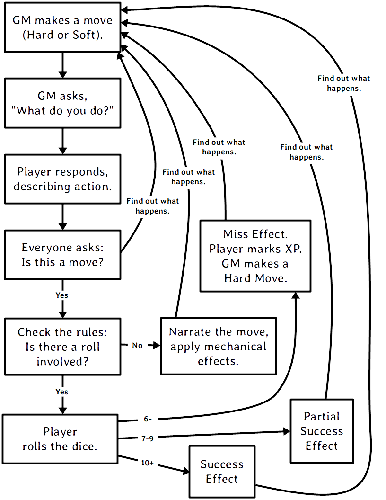

# Playing the Game

This section contains the core rules you need to play Dungeon World.

The most important rule is the first section below: **The Conversation**. Don't skip it! The Conversation affects every other rule in the game.

## The Conversation

Playing Dungeon World means having a conversation; somebody says something, then you reply, maybe someone else chimes in. We talk about the fiction—the world of the characters and the things that happen around them. As we play, the other rules will chime in, too. They have something to say about the world.

Like any conversation, the time you spend listening is just as important as the time you spend talking. The details established by the other people at the table (the GM and the other players) are important to you: they might change what moves you can make, set up an opportunity for you, or create a challenge you have to face. The conversation works best when we all listen, ask questions, and build on each other's contributions.

During the conversation, this basic loop will repeat itself over and over:

1. The GM describes a threat or opportunity. If the threat is new, they don't follow through with it yet.
2. The player describes what their character does.
3. If the player's response triggers a move, they probably roll some dice.
4. The GM describes what the world does, based on the results of the player's action and their roll, if any.

This flowchart lays out the basic flow of the game, including the basic results of **moves**, which are described later in this section.

### The Fiction

"The fiction" is a term that refers to the **established facts of the fictional world that your characters exist in**.

For example, if stone golems are immune to flame in your world, or if your character has big muscles, or if you just sliced the leg of the troll, then that's part of *the fiction*.

If your character has a Strength score of 15, that's not *fiction*, that's just *rules*.

The fiction dictates what happens in the game. If something doesn't make sense in the fiction, it doesn't happen.

If someone says something that doesn't make sense to the GM or aonther player, or that contradicts something that was already said, everyone stops and talks about it until it makes sense. Sometimes, there was just a misunderstanding about the world or what was happening, in which case the misunderstanding gets cleared up. Sometimes, someone forgot what was said a while ago, in which case everyone gets a reminder. Sometimes, someone didn't realize an action was possible, in which case they get a good explanation of it.

The conversation isn't allowed to move on until what's being said makes sense to everyone and there are no contradictions.

### Who Says What

During the conversation, different people will describe different parts of the fiction. But which players will be responsible for describing which parts?

By default, each player is in charge of describing their character's actions, past experiences, and the parts of the world relevant to their specific class, and the GM is in charge of describing the rest of the world, especially as it exists right now, during the game—what NPCs and monsters do, how the world looks, what they think of the player characters, etc. For example, the Wizard describes how magic works, where they learned it, and how they're casting a spell right now. The GM describes how their NPCs use magic, what's become of the Wizard's Arcane school since they last saw it, and what magical creatures are attacking them right now.

If everyone playing agrees, you can divide up description responsibility in other ways. Common alternative ways are:

1. The players only describe their actions and past experiences, the GM describes everything else.
2. Everyone describes the general environment, the GM describes NPCs, monsters, and traps.
3. Everyone describes everything, but the GM describes particularly adversarial actions by NPCs and monsters.

If the GM or a player is responsible for describing a certain part of the fiction, they're free to take suggestions from anyone. But ultimately, it's their call to decide what's true about their part of the world.

### Spotlight

During the conversation, like any other conversation, you'll take turns speaking.

How long should each player talk before someone else gets a turn? There's no strict rule for this. Players take turns in the natural flow of the conversation, which always has some back-and-forth. The GM says something, the players respond. The players ask questions or make statements, the GM tells them what happens next. Dungeon World is never a monologue; it's always a conversation.

A rule of thumb is that each player should talk long enough to do one "action." For example, long enough to attack an enemy, or sneak past the guards. One action might involve one move, multiple moves, or no moves. This is just a rule of thumb, though. Ultimately, the natural flow of conversation is king.

### Other Rules

Other rules may *refer to* the fiction. For example, a rule that applies "when you attack an enemy" applies when you attack an enemy *in the fiction*.

Other rules may *affect* the fiction. For example, a rule that says that "enemies treat you as the most obvious threat" affects what happens in the fiction; in this case, enemies will treat you differently.

Once the rule is done being applied, go back to continue the conversation until the next rule applies. The conversation and rules will flow back and forth, from one to the other, working together to create the game that you're playing.

## Terminology

- **roll+STAT** - Roll 2d6, add them together, and add your STAT modifier.
- **deal your damage** - Roll the base damage die for your class and add any bonuses or penalties from moves, weapons, or effects.
- **roll XdX** - Roll the dice listed and use the total as described. For example, 2d8 means to roll two eight-sided dice and add them together.
- **b[XdX]** - Roll the dice listed and use just the best die (b is for best). For example, b[2d6] means to roll a d6 twice and use only the highest die.
- **w[XdX]** - Roll the dice listed and use just the worst die (w is for worst). For example, w[3d10] means to roll a d10 three times and use only the lowest die.
- **move** - A unit of rule that describes effects that apply to the fiction at a certain time. More on [Moves](#moves) below. The GM has moves as well, but they're not the same; they're described in the [GM](#gm) section.
- **spend hold** - Hold is a resource you can only spend on the move that granted you that hold. If an action taken by spending hold doesn't make sense in the fiction, you can't spend your hold on that. You can have hold from multiple moves at the same time, but you can't spend hold you gained from one move on a different move. For example, hold gained from defend can't be spent on trap expert.
  - **hold X** - Lose all hold for that move and gain X hold.
- **take X forward** - A bonus or penalty that applies to the *next* time you roll+STAT. If a condition is given, it *only* applies to the next time you roll under that condition. For example, "+1 forward against goblins" gives you +1 to the next time you roll+STAT while acting against goblins.
  - **take X damage forward** - The bonus or penalty applies to your damage die the next time you deal damage.
  - **take X armor forward** - The bonus or penalty applies to your armor the next time you take damage.
- **take X ongoing** - A bonus or penalty that applies to *all* your rolls until the effect says it ends (for example, "until you commune"). If a condition is given, it applies every time you roll under that condition. For example, "-1 ongoing to cast a spell" gives you -1 to every time you roll+STAT to cast a spell.
- **mark XP** - Gain 1 XP.

## Ability Scores and Modifiers

Every player character has six ability scores and their corresponding modifiers.

Ability scores measure a player character's raw ability in each of those areas on a scale from 3 to 18, where 18 is the peak of mortal ability. They are:

- Strength
- Constitution
- Dexterity
- Intelligence
- Wisdom
- Charisma

Each ability score has a modifier associated with it that is used when rolling with that ability score. Modifiers range from -3 to +3. The modifier is always derived from the current ability score. These are written as these three-letter abbreviations:

- STR
- CON
- DEX
- INT
- WIS
- CHA

## Moves

The most basic unit of rule in Dungeon World is the move. Moves give the player characters ways to affect the fiction. Many of them tell you when they trigger and what effect they have.

Moves are also sometimes called "player moves." GM moves and monster moves share the same name (unfortunately), but they're different from moves. You can read about them in the [GM](#gm) section.

Here's an example of a move:

---

When you **attack one or more prepared enemies in melee**, roll+STR. ✴On a 10+, you deal your damage to them and choose one:

- Avoid their attack
- Deal +1d6 damage, opening yourself up to their attack

✴On a 7–9, you deal your damage to them and they make an attack against you.

---

A move can have up to three parts: a trigger, a roll, and an effect. Some moves have only an effect. Other moves, such as the move above, have all three parts.

### Triggering Moves

If a move says something like "When you X..." then that move has a trigger. The trigger tells you when the move's effect applies.

When you meet the trigger for the move, the move's effect always applies. You can't avoid the move's effect if you meet the move's trigger. If you want to use a move's effect, and the effect depends on a trigger, you must meet the trigger first. The trigger and the effect go hand-in-hand.

Some move triggers depend on a fictional action. For example, the move above triggers "when you attack one or more prepared enemies in melee." In order to meet that trigger, you have to describe how your character attacks one or more prepared enemies in melee; otherwise, the move doesn't trigger. They don't roll, and they don't get any of the effects of the move (dealing damage, etc.).

For example, if Isaac tells the GM that his character dashes past a crazed axe-wielding orc to the open door, he makes the defy danger move because its trigger is "when you act despite an imminent threat." Isaac can't just describe his character running past the orc without making the defy danger move. If you do it, then you do it.

For another example, if Isaac tells the GM that he wants to roll to hack and slash the crazed axe-wielding orc standing in his way, his character *first* has to attack the orc in melee, and Isaac should describe his character doing that. To do it, you do it.

Everyone at the table should listen for when moves trigger, not just the GM. If it's ever unclear whether or not a move has been triggered, everyone should work together to clarify what's happening in the fiction. Ask questions of everyone involved until everyone sees the situation the same way, and then roll the dice, or don't, as the situation requires.

### Moves and Dice

If a move requires a roll, its description will tell you what dice to roll and how to read their results.

Many moves include the phrase "roll+STAT" where "STAT" is one of your character's ability modifiers (CON for example) that you add to the roll. Some moves will have you add some other value to your roll instead of an ability modifier.

> I'm making a move that asks me to roll+STR and my STR modifier is +1. I rolled two six-sided dice, got a one and a four. My total is six.

When you roll+STAT, there are three basic results:

- A total of 10 or higher (written 10+) is the best outcome.
- A total of 7–9 is still a success but it comes with compromises or cost.
- A 6 or lower (written 6-) is trouble, but you always mark XP.

Each move will tell you what happens on a 10+ and a 7–9. Most moves won't say what happens on a 6-; in that case, whether or not you succeed is up to the GM, but you always mark XP.

The GM *never* needs to roll the dice! Their characters are governed by different rules than player characters (covered in the [GM](#gm) section). They don't roll to make moves like the player characters, but they may roll to deal damage—the players may roll the GM characters' damage too. The dice are not a secret.

### The Effects of Moves

The effects of moves are always about the fictional world the characters inhabit. A 10+ on hack and slash doesn't just mean the mechanical effects, it means you successfully attacked something and did some type of harm to it.

Once you've figured out what the effects of the move are, apply them to the fiction and go back to the conversation. Always return to what's going on in the game.

If a move asks you make a choice, the choice you make, like all move effects, dictates things that happen in the fiction in addition to any more mechanical effects. The choice you make on the 10+ result of hack and slash to deal more damage at the cost of opening yourself up is exactly what's happening to your character: they have enough advantage that they can stay safe or push their luck. If a choice in a move doesn't make sense or can't be applied to the fiction, then you can't make that choice.

Some moves have immediate mechanical effects, like dealing damage or giving someone a bonus to their next roll. These effects are always a reflection of the fictional world the characters are in; make sure to use the fiction when describing the effects of the move.

### Equipment and Moves

A character's equipment, first and foremost, helps describe their actions and helps decide which moves are triggered.

Equipment such as weapons, armor, and gear, changes how the fiction is described. A character without a weapon of some sort isn't going to trigger the hack and slash move when fighting a dragon since a bare-knuckle punch against inch-thick scales isn't really an "attack." It doesn't count for the purposes of triggering the move.

Sometimes equipment will *avoid* triggering a move. Climbing a sheer icy cliff is usually defying danger, but climbing with a good set of climbing gear might be able to avoid the imminent danger that triggers the move.

Weapons are particularly likely to modify what moves you can trigger. A character with a dagger can easily stab the goblin gnawing on his leg, triggering hack and slash, but a character with a halberd will have a much harder time bringing it to bear on such a close foe.

Items and gear of every sort have tags. Tags are terms to describe things. Some tags have a specific effect on the rules (things like damage reduction on armor or a magical bonus to a particular kind of move or stat). Other tags are purely about the fiction (like the close tag, which describes the length of a weapon and how near your enemies need to be for you to attack them). Tags help you describe your character's actions when the items are being used and they give the GM information about how the items you're using might go wrong or cause complications when you fail a roll.

## Harm and Healing

Characters, NPCs, and monsters all can get hurt, be healed, and die. These things happen first and foremost in the fiction. Some rules govern how they get hurt, how much they get hurt, and when they die.

A character's health is measured by their hit points (HP). Damage subtracts from HP. Armor reduces damage when it's taken. In the right conditions, or with medical or magical help, damage is healed and HP is restored.

Characters and monsters have HP and armor, and they and deal damage. NPCs and other creatures don't have HP or damage—they get hurt, healed, and die based on what happens in the fiction.

### HP

A character's HP is a measure of their stamina, endurance, and health. More HP means the character can fight longer and endure more trauma before facing Death.

Your class tells your maximum HP. Your Constitution (the ability, not the modifier) gets added to your maximum HP, so more Constitution means more HP. If your Constitution permanently changes during play, you adjust your HP to reflect your new Constitution score. Unless your Constitution changes, your maximum HP stays the same.

You can never go below 0 HP. A character who is reduced to 0 HP immediately takes his Last Breath. Depending on the outcome of the Last Breath the character may become stable. A stable character stays at 0 HP but is alive and unconscious. If they receive healing they regain consciousness and may return to battle or seek safety. If a stable character takes damage again, they're dying again, and they draw their Last Breath once more and return to face Death.

Monsters have HP too. At 0 HP, they're dead, no last breath.

HP loss is often only part of the effect of damage. If the harm is generalized, like falling into a pit, losing the HP is probably all there is to it. When the harm is specific, like an orc pulling your arm from its socket, sure you lose HP, but the bigger issue is dealing with the newly busted arm: how do you swing a sword or cast a spell? Likewise having your head chopped off is not HP damage, it's just you being dead.

### Damage

How much damage is dealt is determined by the attacker. When a character takes damage, they subtract the damage dealt from their current HP.

Damage is dealt based on the fiction. Moves that deal damage as part of their effect, like hack and slash, are just a special case of this: the move establishes that damage is being dealt in the fiction.

Whenever you make an attack that could reasonably hurt your target, you deal your damage. Usually that means you're wielding a weapon, but your fists can be weapons with the right training or an interesting situation.

When you attack an unprepared or defenseless enemy, you deal your damage to them or kill them outright, the GM will tell you which.

Damage never goes negative—0 damage is the minimum.

#### Monster Damage

Monsters roll damage as listed in their description. Use this damage any time the monster takes direct action to hurt someone, even if they use a method other than their normal attack. A monster's damage is rolled in the open, by the players or the GM.

#### Other Damage

Other sources of damage—like being struck by a chunk of a collapsing tower, or falling into a pit—are left to the GM based on these options:

- It threatens bruises and scrapes at worst: d4 damage
- It's likely to spill some blood, but nothing horrendous: d6 damage
- It might break some bones: d8 damage
- It could kill a common person: d10 damage

Add the *ignores armor* tag if the source of the damage is particularly large or if the damage comes from magic or poison.

#### Damage From Multiple Creatures

If multiple creatures attack at once, roll the highest damage among them and add +1 damage for each monster beyond the first.

> A goblin orkaster (d10+1 damage ignores armor) and three goblins (d6 damage) all throw their respective weapons—a magical acid orb for the orkaster, spears for the rest—at Lux as she assaults their barricade. I roll the highest damage, d10+1 ignores armor, and add +3 damage for the three other goblins. Adding it all up I tell Lux she takes 9 damage ignoring armor as the acid leaks into the scratches left by the spears.

#### Stun Damage

Stun damage is non-lethal damage and doesn't reduce HP. Whenever a player describes their attack in a non-lethal way, they deal stun damage instead.

A player character who takes stun damage is defying danger to do anything at all, the danger being "you're stunned." This lasts as long as makes sense in the fiction—you're stunned until you can get a chance to clear your head or fix whatever stunned you.

A GM character that takes stun damage will act accordingly, staggering around for a few seconds, fumbling blindly, etc.

### Armor

Armor mitigates damage. When a character takes damage, they subtract their armor from the damage dealt. For example, a character that takes 5 damage with 1 armor would only lose 4 HP. This might mean a blow is turned away completely—that's fine, it's what armor is for!

> The orc just cut me with his nasty knife. That means I take d8+2 damage. I rolled a 5, so I take 7 damage. But, I have 2 armor, so that means I only take 5 damage.

Temporary or circumstantial armor works the same way as armor that you wear. When hit by ranged attacks, creatures get:

- 1 armor for partial cover
- 2 armor for major cover

### Healing

There are two sources of healing in Dungeon World: medical aid and the passage of time.

Medical aid, both magical and mundane, heals damage according to the move or item used. Some moves may fully replenish HP while others heal just enough to keep someone standing through a fight.

Whenever a character spends some time resting without doing anything to aggravate their wounds, they heal. The amount of healing is described in the applicable moves: Make Camp for a night in a dangerous area, Recover for stays in civilization.

No matter the source of the healing, a character's HP can never be above their maximum.

### After Death

Being an adventurer isn't easy—it's cold nights in the wild and sharp swords and monsters. Sooner or later, you're going to make that long walk to the Black Gates and give up the ghost. That doesn't mean you have to give it the satisfaction of sticking around. Death, in its way, is just another challenge to conquer. Even dead adventurers can rise again.

If your character dies you can ask the GM and the other players to try and resurrect you. The GM will tell them what it will cost to return your poor, dead character to life. If you fulfill the GM's conditions the character is returned to life. The Resurrection spell is a special case of this: the magic of the spell gives you an easier way to get a companion back, but the GM still has a say.

No matter the prospects of resurrection, for now you make a new character. Maybe a hireling becomes a full-fledged adventurer worthy of a whole share and a part in the real action. Maybe the characters in the party find a new friend in a steading, willing to join them. Maybe your character had a vengeful family member who now seeks to take up their blades and spells to make right what happened. In any case, make your new character as you normally would at level 1. If your original character returns to life you can play either character, switching between them as you please (so long as it makes sense).

GM, when you tell the players what needs to be done to bring their comrade back, don't feel like it has to derail the flow of the current game. Weave it in to what you know of the world. This is a great opportunity to change focus or introduce an element you've been waiting to show off. Don't feel, either, that it has to be some great and epic quest. If the character died at the end of a goblin pike, maybe all it takes is an awkward walk home and a few thousand gold pieces donated to a local temple. Think about the ramifications of such a charitable act and how it might affect the world. Remember: Death never forgets a soul stolen from his realm.

### Debilities

Debilities are deeper wounds than just losing HP. These are wounds that stick around for a while.

Each debility gives you a -1 to one of your ability modifiers. Your ability scores are unchanged by debilities.

**Weak (STR):** You can't exert much force. Maybe it's just fatigue and injury, or maybe your strength was drained by magic.

**Shaky (DEX):** You're unsteady on your feet and you've got a shake in your hands.

**Sick (CON):** Something just isn't right inside. Maybe you've got a disease or a wasting illness. Maybe you just drank too much ale last night and it's coming back to haunt you.

**Stunned (INT):** That last knock to the head shook something loose. Brain not work so good.

**Confused (WIS):** Ears ringing. Vision blurred. You're more than a little out of it.

**Scarred (CHA):** It may not be permanent, but for now you don't look so good.

You can only have each debility once. If you're already Sick and something makes you Sick, you just ignore it. If an effect has you choose a debility to take, you can't choose a debility you already have.

Not every attack inflicts a debility—they're most often associated with magic, poison, or stranger things like a vampire sucking your blood.

Debilities are harder to heal than HP. Some high level magic can do it, sure, but your best bet is getting somewhere safe and spending a few days in a soft, warm bed. Of course, debilities are both descriptive and prescriptive: if something happens that would remove a debility, that debility is gone.

Debilities don't replace descriptions and using the established fiction. When someone loses an arm that doesn't mean they're Weak, it means they have one less arm. Don't let debilities limit you. A specific disease can have whatever effects you can dream up. Sick is just a convenient shorthand for some anonymous fever picked up from a filthy rat.

## Magic

"Magic" is the name given to those abilities not derived from the strength of man and beast but from forces beyond. Dungeon World is a fantastic place: there's more to it than mud, blood, and ale in the tavern. Fire and wind conjured from the pure elements. Prayers for health, might, and divine retribution.

Any ability that goes beyond the physically possible is magical. The druid's ability to take the shape of an animal is magic, as are the practiced effects of the wizard and the divine blessings of the cleric.

### Spells

Every spell has a name, tags, a level, and an effect. Some classes, like the cleric and the wizard, start with access to spells: specific magical effects that are the benefit of divine servitude or severe study.

The basic flow of magic is to know, prepare, cast, and forget a spell.

Known spells are those a spellcaster has mastered enough to prepare. The cleric knows all cleric spells of their level or lower, including their rotes. The wizard starts knowing their cantrips and three 1st level spells. When the wizard gains a level, they learn a new spell. The wizard stores their known spells in their spellbook.

A spellcaster must prepare a spell they know before they can cast it. With some time and concentration, as described in the Commune and Prepare moves, the spellcaster may choose known spells whose total levels are less than or equal to the caster's level plus 1 to prepare. The wizard always prepares their cantrips; the cleric always prepares their rotes. A prepared spell is ready to be cast.

Casting a spell involves calling on a deity, chanting, waving ones hands, invoking mystical forces, and so on. To cast a spell, you will usually make the cast a spell move. On a 10+, the spell takes effect; on a 7–9, the caster finds themself in trouble and must make a choice, but the spell is still cast. Some spells are ongoing—once they're cast, they continue to have effect until something ends it.

One option on a 7–9 result is to have the spell revoked or forgotten. A spell that is revoked or forgotten is still known, but no longer prepared, and therefore no longer castable. When the caster next Prepares or Communes, they may choose to prepare that spell again.

## Character Change

As the player characters' adventures progress, they gain experience (XP). XP lets them level up the next time they have safety and a chance to rest. When a character levels up, they increase one of their ability scores and gain a new advanced move. This prepares them for greater danger, bigger adventures, and mightier deeds.

Advancement, like everything else in Dungeon World, is both prescriptive and descriptive. Prescriptive means that when a player changes their character sheet the character changes in the fiction. Descriptive means that when the character changes in the fiction the player should change the character sheet to match.

This isn't a benefit or detriment to the players or the GM; it's not an excuse to gain more powers or take them away. It's just a reflection of life in Dungeon World.

> Avon, despite being a wizard, has risen to the notice of Lenoral, the deity of arcane knowledge. After being blessed by an avatar of Lenoral and saying his vows in the church, Avon is under the deity's watch. He can fulfill Petitions and gain boons like a cleric.

> Gregor offers his signature weapon, an axe whose green steel is tempered in orc blood, as a desperate bargain to save King Authen from eternal damnation. Without his axe he gets none of the benefits of his signature weapon. Should he recover it he'll have access to its benefits again.

Descriptive changes only happen when the character has clearly gained access to an ability. It's not up to any one player to decide this—if you think a character qualifies for a new ability, discuss it as a group until everyone agrees one way or another.

### Earning XP

At the end of each session, you'll be awarded XP at the end of the session. Three things give XP to the whole group, which means you'll be doing those things most of all: exploring, fighting dangerous foes, and gathering treasure. Acting according to your alignment will also grant you XP at the end of each session. If you resolve a bond and create a new one, you'll gain XP, too.

Any time you roll a 6-, you get 1 XP right away. Some moves grant you XP for fulfilling certain conditions, such as the Barbarian's Outsider race move and the Wizard's Know-It-All move.

The GM may have special conditions that you can fulfill to earn XP or might change the core ones to reflect the world. They'll let you know before you play.

### Multiclass Moves

Multiclass moves allow you to gain a move from another class. You get to choose any move of your level or lower.

For the purpose of multiclassing, any starting class moves that depend on each other count as one move. These starting moves for the base classes are considered one move for the purposes of multiclassing—if you take one of these moves, you get the other move or moves in that set as well:

- *Cleric*: Cast a Spell, Commune
- *Cleric*: Deity, Divine Guidance
- *Druid*: Born of the Soil, Shapeshifter
- *Ranger*: Animal Companion, Command
- *Wizard*: Cast a Spell, Spellbook, Prepare Spells

If a move from another class refers to your level (for example, Prepare Spells), count your levels from the level where you first gained a move from that class.

### Requires and Replaces

Some advanced moves that you gain at higher levels depend on other moves. If a move *Requires* or *Replaces* another move, you cannot take the new move if you don't have the prerequisite move.

A move that *requires* another move can only be taken if you have the move it requires already. You then have both moves and they both apply.

A move that *replaces* another move can only be taken if you have the move it replaces already. You lose access to the replaced move and only have the new one. The new move will usually include all the benefits of the replaced one: for example, you may replace a move that gives you 1 armor with one that gives you 2 armor instead.

### Beyond 10th Level

When you have enough XP to level up to 11th level, your character chooses one of these options instead:

- Retire to safety
- Take on an apprentice
- Change entirely to a new class

If you retire, you keep your character as your own, but give them an important place in the world. Perhaps the Wizard opens her own school of magic, or the Thief retires to a life of luxury protected by their own thieves' guild. Then, you create a new character to play instead and work with the other players to establish your new character's place in the world.

If you take on an apprentice, you play a new character (the apprentice) alongside your current character. Your first character stops gaining XP from any source, even when they roll a 6- (your apprentice does not gain XP that would have been gained by your first character). Your apprentice can be any class you like.

If you change to a new class, you keep your ability scores, race, HP, and whatever moves you and the GM agree are core to who your character is. You lose all other class moves, replacing them with the starting moves of your new class. Your base damage is replaced by the base damage of your new class.

## Bonds

Bonds are what make you a party of adventurers, not just a random assortment of people. They're the feelings, thoughts, and shared history that tie you together. You will always have at least one bond, and you'll often have more.

Each bond is a simple statement that describe how your character relates to another player character. Your class gives you a few to start with. You'll replace your starting bonds and gain new ones through play.

### Resolving Bonds

At the end of each session you may resolve one bond. Resolution of a bond depends on both you and the player of the character you share the bond with: you suggest that the bond has been resolved and, if they agree, it is resolved. When you resolve a bond, you mark XP.

A bond is resolved when it no longer describes how you relate to that person. That may be because circumstances have changed—Thelian used to have your back but after he abandoned you to the goblins, you're not so sure. Or it could be because that's no longer a question—you guided Wesley before and he owed you, but he paid that debt when he saved your life with a well-timed spell. Any time you look at a bond and think "that's not a big factor in how we relate anymore" the bond is at a good place to resolve.

If you have a blank bond left over from character creation, you can assign a name to it or cross it out and write a new bond in its place whenever you like. You don't get XP for doing writing new bonds, but you do get more defined bonds to resolve in the future.

### Writing New Bonds

Whenever you resolve an old bond, you write a new one. Your new bond may be with the same character, or it may be with a different character.

When you write a new bond, choose another character. Pick something relevant to the last session—maybe a place you traveled together or a treasure you discovered. Choose a thought or belief your character holds that ties the two together and an action, something you're going to do about it.

If you want to use a template, write your bonds like this:

*Another character did a thing this session, therefore I will do/think/believe/feel this.*

You'll end up with something like this:

> Mouse's quick thinking saved me from the white dragon we faced. I owe her a boon.
>
> Avon proved himself a coward in the dungeons of Xax'takar. He is a dangerous liability to the party and must be watched.
>
> Valeria's kindness to the Gnomes of the Vale has swayed my heart, I will prove to her I am not the callous fiend she thinks I am.
>
> Xotoq won the Bone-and-Whispers Axe through trickery\! It will be mine, I swear it.

These new bonds are just like the old ones—use them, resolve them, replace them.

## Alignment

### About

Alignment is your character's way of thinking and moral compass. For the character, this can be an ethical ideal, religious strictures, or maybe just a gut instinct. It reflects the things your character might aspire to be and can guide you when you're not sure what to do next. Some characters might proudly proclaim their alignment while others might hide it away. A character might not say, "I'm an evil person," but may instead say, "I put myself first." That's all well and good for a character, but the world knows otherwise. Buried deep down inside is the ideal self a person wants to become—it is this mystic core that certain spells and abilities tap into when detecting someone's alignment. Every sentient creature in Dungeon World bears an alignment, be they an elf, a human, or some other, stranger thing.

### Alignments

The alignments are Good, Lawful, Neutral, Chaotic, and Evil. Each one shows an aspiration to be a different type of person:

- **Lawful** creatures aspire to impose order on the world, either for their own benefit or for that of others.
- **Chaotic** creatures embrace change and idealize the messy reality of the world, prizing freedom above all else.
- **Good** creatures seek to put others before themselves.
- **Evil** creatures put themselves first at the expense of others.
- **Neutral** creatures look out for themselves so long as that doesn't jeopardize someone else's well-being. Neutral characters are content to live their lives and pursue their own goals and let others do the same.

Most creatures are Neutral. They take no particular pleasure in harming others, but will do it if it is justified by their situation. Those that put an ideal—be it Law, Chaos, Good, or Evil—above themselves are harder to find.

Even two creatures of the same alignment can come into conflict. Aspiring to help others does not grant infallibility. Two Good creatures may fight and die over two different views of how to do right.

### Changing Alignment

When you feel your character's current alignment no longer describes them, explain your reasoning to the other players. Then, choose a new alignment, either from your character's class or from the list of alignments below.

If your character's view of the world has fundamentally shifted, you can choose a completely different alignment—choosing Chaotic when your character was Neutral, for example. If your character has simply changed their priorities, you can choose a new alignment description while keeping the same basic alignment—choosing "Good: Show mercy" to replace "Good: Endanger yourself to protect someone weaker than you," for example.

#### Lawful

- Uphold the letter of the law over the spirit
- Fulfill a promise of import
- Bring someone to justice
- Choose honor over personal gain
- Return treasure to its rightful owner

#### Good

- Ignore danger to aid another
- Lead others into righteous battle
- Give up powers or riches for the greater good
- Reveal a dangerous lie
- Show mercy

#### Neutral

- Make an ally of someone powerful
- Defeat a personally important foe
- Learn a secret about an enemy
- Uncover a hidden truth

#### Chaotic

- Reveal corruption
- Break an unjust law to benefit another
- Defeat a tyrant
- Reveal hypocrisy

#### Evil

- Take advantage of someone's trust
- Cause suffering for its own sake
- Destroy something beautiful
- Upset the rightful order
- Harm an innocent

## Hirelings

Hirelings are NPCs who travel with and work for the players. They might be specialists that the players recruited for a particular job, or they might be sorry souls hired to buy the players some extra time against the dangers that await them.

<!-- Hirelings are those souls that—for money, glory, or stranger needs—venture along with adventurers into the gloom and danger. They are the foolhardy that seek to make their name as adventurers. -->

Hirelings serve a few purposes. To the characters, they're the help. They lend their strength to the player characters' efforts in return for their pay, whatever that may be. To the players, they're a resource. They buy the characters some extra time against even the most frightening of threats and unlock opportunities that they may not have otherwise. They're also replacement characters, waiting to step up into the hero's role when a player character falls. To the GM, they're a human face for the characters to turn to, even in the depths of the earth or the far reaches of the planes.

Hirelings are not heroes. A hireling may become a hero, as a replacement character, but until that time they're just another GM character. As such they don't have exact HP, armor, or damage. A hireling is defined by their **Skill** (or Skills), a **Cost**, and a **Loyalty** score.

A hireling's skills are special benefits they provide to the players. Most skills are related to class abilities, allowing a hireling to fill in for a certain class. If you don't have a ranger but you need to track the assassin's route out of Torsea anyway, you need a Tracker. Each skill has a rank, usually from 1 to 10. The higher the rank the more trained the hireling.

Generally, hirelings only work for adventurers of equal or higher level than their highest skill.

Skills don't limit what a hireling can do, they just provide mechanics for a certain ability. A hireling with the protector skill can still carry your burdens or check for traps, but the outcome isn't guaranteed by a rule. It will fall entirely to the circumstances and the GM. Hirelings may have specialized knowledge or abilities not covered by their skills—these are handled through the fiction and conversation. Sending a hireling to do something that is clearly beyond their abilities is asking the GM for trouble.

### Making a Hireling

Hirelings can be made on the fly. When someone enters the players' employ, write down their name and what cost they've agreed to as well as any skills they may have.

Choose a number based on what kind of steading the hireling was found in. Higher numbers indicate more valuable hirelings.

- Village hireling: 2-5
- Town hireling: 4-6
- Keep hireling: 5-8
- City hireling: 6-10

Distribute the hireling's number between loyalty and any number of skills, starting with their main skill. Choose a cost for the hireling and you're done.

> The players just lost their fighter Brianne, so they decided to recruit a retired soldier named Hawke as a bodyguard to help them get safely to the remote temple where they can resurrect her. They recruit Hawke in a town, so the GM starts with the number 5. One point goes into Loyalty, so he gets +1 Loyalty. Hawke's main skill is defense-related, so the GM gives him Protector 3. He has one point left, so the GM gives him a secondary skill, Warrior 1. This is just a job for Hawke, so he gets Cost: Money. The players will have to pay him for his protective services.

### Loyalty

A hireling's loyalty usually starts at +0, +1, or +2. Starting loyalty higher than or lower than that is unusual.

A hireling's stats, especially their loyalty, may change during play as a reflection of events. A particular kindness or bonus from the players is worth +1 loyalty forward. Disrespect is -1 loyalty forward. A hireling's loyalty may be permanently increased when they achieve some great deed with the players. A significant failure or beating may permanently lower the hireling's loyalty.

When hirelings are in play, the players may have to make the Order Hirelings move. The move uses the loyalty of the hireling that triggered the move:

---

#### Order Hirelings

Hirelings do what you tell them to, so long as it isn't obviously dangerous, degrading, or stupid, and their cost is met. **When a hireling finds themselves in a dangerous, degrading, or just flat-out crazy situation due to your orders** roll+loyalty. On a 10+ they stand firm and carry out the order. On a 7–9 they do it for now, but come back with serious demands later. Meet them or the hireling quits on the worst terms.

---

### Costs

No hireling works for free. The hireling's cost is what it takes to keep them with the player characters. If the hireling's cost isn't paid regularly (usually once a session), they're liable to quit or turn on their employers.

If it's been a while since a hireling's cost was last paid, they get -1 loyalty ongoing until their cost is met.

- The Thrill of Victory
- Money
- Uncovered Knowledge
- Fame and Glory
- Debauchery
- Good Accomplished

### Skills

When you make a hireling, distribute points among one or more of these skills, listed below. Each skill comes with one or more hireling abilities, listed in *italics* beneath each skill.

#### Adept

An adept has at least apprenticed to an arcane expert, but is not powerful in their own right. They're the grad students of the arcane world.

*Arcane Assistance*—When an adept aids in the casting of a spell of lower level than their skill, the spell's effects have greater range, duration, or potency. The exact effects depend on the situation and the spell and are up to the GM. The GM will describe what effects the assist will add before the spell is cast. The most important feature of casting with an adept is that any negative effects of the casting are focused on the adept first.

#### Burglar

Burglars are skilled in a variety of areas, most of them illicit or dangerous. They are good with devices and traps, but not too helpful in the field of battle.

*Experimental Trap Disarming*—When a burglar leads the way, if a trap would be sprung, the burglar detects it almost in time. They suffer the full effects, but the players get +skill against the trap and add the burglar's skill to their armor against the trap. Most traps leave a burglar in need of immediate healing. If the players Make Camp near the trap, the burglar can disarm it by the time camp is broken.

#### Minstrel

When a smiling face is needed to smooth things over or negotiate a deal a minstrel is always happy to lend their services for the proper price.

*A Hero's Welcome*—When you enter a place of food, drink, or entertainment with a minstrel you will be treated as a friend by everyone present (unless your actions prove otherwise). You also subtract the minstrel's skill from all prices in town.

#### Priest

Priests are the lower ranking clergy of a religion, performing minor offices and regular sacraments. While not granted spells themselves, they are able to call upon their deity for minor aid.

*Ministry*—When you make camp with a priest if you would normally heal you heal +skill HP.

*First Aid*—When a priest staunches your wounds heal 2×skill HP. You take -1 forward as their healing is painful and distracting.

#### Protector

A protector stands between their employer and the blades, fangs, teeth, and spells that would harm them.

*Sentry*—When a protector stands between you and an attack you increase your armor against that attack by the defender's skill, then reduce their skill by 1 until they receive healing or have time to mend.

*Intervene*—When a protector helps you defy danger you may opt to take +1 from their aid. If you do you cannot get a 10+ result, a 10+ instead counts as a 7–9.

#### Tracker

Trackers know the secrets of following a trail, but they don't have the experience with strange creatures and exotic locales that make for a great hunter.

*Track*—When a tracker is given time to study a trail while Making Camp, when camp is broken they can follow the trail to the next major change in terrain, travel, or weather.

*Guide*—When a tracker leads the way you automatically succeed on any Perilous Journey of a distance (in rations) lower than the tracker's skill.

#### Warrior

Warriors are not masters of combat, but they are handy with a weapon.

*Man-at-arms*—When you deal damage while a warrior aids you add their skill to the damage done. If your attack results in consequences (like a counter attack) the man-at-arms takes the brunt of it.

## The Adventurer's Life

Now you know the basics. It's time you found out what the adventurer's life is really like. They say it's all gold and glory. That's sometimes true, but sometimes it also means digging through otyugh waste for a chance at one more gold coin.

### Dungeons

As an adventurer you'll spend a lot of time in dungeons. The word "dungeon" conjures up an image of the stony halls under a castle where prisoners are kept, but a dungeon is really any place filled with danger and opportunity. A dragon's cave, an enemy camp, a forgotten sewer, a sky castle, the very foundations of the world.

The most important thing to remember when you're in a dungeon is that it's a living place. Just because you cleared the guards out of the entryway doesn't mean they won't be replaced by fresh recruits. Every monster, soldier, or leader you kill has friends, mates, followers, and spawn somewhere. Don't count on anything in a dungeon.

Since dungeons are living places you'd better prepare for the long haul. Rations are your best friend. Delving into the Hall of Xa'th'al isn't a day trip. Once you're inside your exit might be blocked. Even if you could just waltz out the time you spend doing it just gives your enemies time to prepare. Those goblins aren't tough, but when they have time to rally and prepare traps…

Speaking of traps—keep your eyes open for them, too. The thief is your best friend there. They can stop you before you wander into a pit trap or fill the room with acid. Without one you're not in dire trouble, but you're likely to need to take your time and be extra careful. You can investigate an area by discerning realities, but you'll be taking more risks than a skilled thief would.

When you're unlucky enough to trigger a trap you might have a chance to get out of the way, throw up a quick protective spell, or save a friend—most likely by defying danger. Of course not every trap is so crude as to give you time to get out of the way. A well-built trap will have a blade in your side before you even know it's sprung.

That sounds grim, sure, but it's not as bad as all that. You've got steel, skills, and spells. If you stick together and keep your wits you'll make it out alive. Probably.

### Monsters

The beasts and worse that fill dungeons? We call them monsters.

Not all of them appear monstrous. Sometimes it's just a guy in some armor—no horns, flames, or wings, nothing. But when that guy wants to kill you, well, he's as much a monster as the rest.

Some don't even need arms and armor. A wily warlock or nefarious noble can stab you in the back a dozen times with a word or two. Be wary of anyone who can stroll around a dungeon with nothing but a robe and a staff: there's a reason they don't need a shell of steel.

When it comes to fighting monsters, it's an even bet: your life versus theirs. You should know that going into it. If you can avoid it, never fight with even odds. Unless you have the advantage you're probably better off working to gain that advantage than betting your life on a fight. Find their weaknesses, pad your advantages, and you'll live long enough to enjoy the spoils.

Fights often mean triggering moves like hack and slash, defend, or volley. Defy danger comes up pretty often too, and class moves like cast a spell. The best fight for you is one where you have the drop—since hack and slash is triggered by attacking in melee, and a defenseless enemy isn't really in melee, the move won't trigger—you'll just bury a weapon or spell in their back and deal your damage.

Monsters generally fall into a few types. Humanoids are more or less like you—orcs, goblins, and so on. Beasts are animals, but not so docile as Bessie the cow: think foot-long horns and acid sacs. Constructs are crafted life. Planar monsters come from beyond this world, from places only dreamed of. The undead might be the worst of all: that which is dead is damn hard to kill again.

When you find yourself in a fight with a monster you have a few different tricks up your sleeve that can help you survive. If the monster's something you might know about, you could consult your knowledge and spout lore. It never hurts to take a minute to look around and discern realities, too—there might be something helpful nearby that you missed. Make sure you understand your class moves and how they can help you, too. You never know when a move might come in handy in a new way.

### Wilderness

There's dungeons, there's civilization, and there's all the stuff in-between: the wilderness. The line between a forest and a dungeon is thinner than you might think—have you ever been lost in the night and surrounded by wolves?

Journeys by road are easy. When you've got a trail to follow and some modicum of protection you're not even making moves—you just consume some rations on the way and make it to your destination. If it's a perilous journey though…

On a perilous journey you'll need a trailblazer, a scout, and a quartermaster. That means you'll probably want at least three people when you're traveling in dangerous areas. Fewer than three and you'll be neglecting something—that's an invitation for trouble.

### Friends and Enemies

You're an adventurer, so people will pay attention to you. Not all of that attention is going to be positive. You'll find that, especially once you're laden down with ancient treasure, all manner of hangers-on will appear from the woodwork.

Sure, you can get leverage on these people and parley them to get what you want, but the way to build a lasting connection is to do right by them. Forcing Duke Alhoro to give you a castle in return for his daughter will get you the land, but the reputation that comes along with your shady dealing won't do you many favors. Coercion isn't mind control, so play it nice if you want to make friends.

Magic, though, that just might be mind control. The morality of it's debatable but you can bend someone to your will if you don't mind tossing their free will in the corner.

It's worth keeping track of who's got your back and who'd sooner stab you in it. The GM will be doing the same, and the worst enemy is the one you don't know. You're not the only ones in Dungeon World with grand designs.

While you live the adventurer's life, with no fixed address to give, other folks are likely to be more settled. Knowing where the blacksmith is that does the best work, or which town's inns will put you up free of charge, is a fine thing indeed.

Keep in mind that not all power is physical. Even if you could take down King Arlon in a fight you'll just be inviting retribution from his kin, allies, and court. Station is its own kind of power apart from magic and might.

### The World

You're an adventurer; you're a big deal. But there are other forces at work too. The world will go on without you. If you don't deal with the goblin infestation in the sewers maybe someone else will. Or maybe the goblins will take over the city. Do you really want to find out?

A world in motion is a world waiting to be changed. Your choices of who to kill (or not), where to go, what bargains to make—it all changes the world you're in. Changing the world requires acting on it—making moves and pursuing treasure and exploration. Change comes in many forms, including XP used to level up and gain new abilities. Those abilities are then used to go back out into the world and stir things up. It's a cycle of change and growth for both you and the world you live in.
